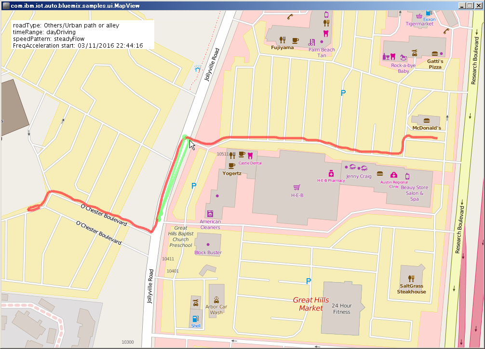
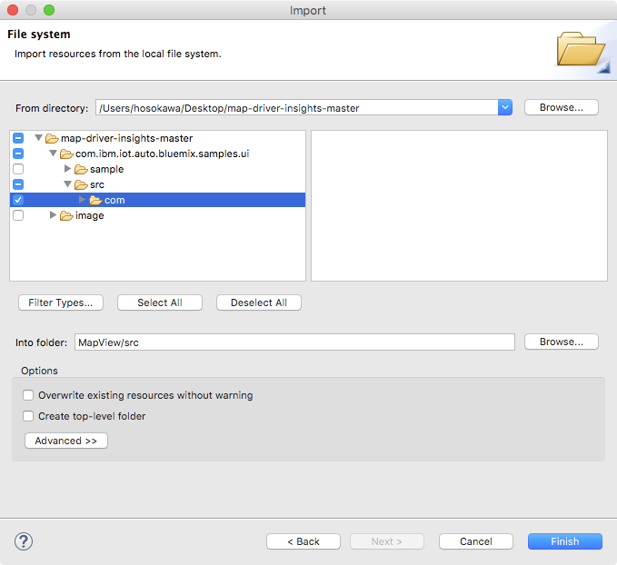
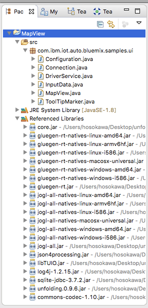
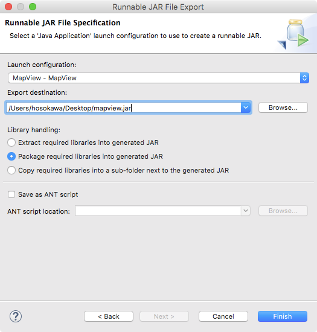

# Context Mapping and Driver Behavior Tutorial Part 2: Displaying the analysis result on a Java client map UI

This second part of the tutorial describes how you can display the driver behavior data that was created in part 1 of this tutorial as a map overlay where driving behavior such as harsh braking or frequent acceleration can be identified.

<p align="center">

</br>Figure of the MapView user interface with a sample trip and trip data overlay.
</p>

## Overview

In part 2 of this tutorial, you will learn the following:

1. How to build the *map-driver-insights* application in Eclipse.
2. How to create and configure the *MapView* .jar.
3. How to run the *MapView* UI to explore driver behavior.

### Architecture
<p align="center">

</br>Architecture diagram of the Watson IoT Context Mapping and Driver Behavior services.
</p>

## Before you begin
## System requirements
To complete the tutorial, the following prerequisite software must be installed on your system:

- Java 1.7 or higher to run the *MapView* application.
- [Eclipse](https://eclipse.org/) to build the *map-driver-insights* application.

## Deliverables
When you complete part 2 of this tutorial, the following components are downloaded:  

|Directory|File|Description|
|---------|----|-----------|
|[com.ibm.iot.auto.bluemix.samples.ui](com.ibm.iot.auto.bluemix.samples.ui/src/com/ibm/iot/auto/bluemix/samples/ui/)|`*.java`|Source files for sample application. [MapView.java](com.ibm.iot.auto.bluemix.samples.ui/src/com/ibm/iot/auto/bluemix/samples/ui/MapView.java) contains the `main()` method.|
|[sample](com.ibm.iot.auto.bluemix.samples.ui/sample/)|[CarProbeSample.json](com.ibm.iot.auto.bluemix.samples.ui/sample/CarProbeSample.json)|Input file for sample application.|
||[mapview.json](com.ibm.iot.auto.bluemix.samples.ui/sample/mapview.json)|Configuration file for sample application. Edit this file to configure 'Driver Behavior' service.|


### Bluemix applications and services  
To complete the instructions in this tutorial, the following services are required in your Bluemix organization:

   * [IoT Context Mapping](https://console.ng.bluemix.net/catalog/services/context-mapping/)
   * [IoT Driver Behavior](https://console.ng.bluemix.net/catalog/services/driver-behavior/)
   * [IoT Platform](https://console.ng.bluemix.net/catalog/services/internet-of-things-platform/)
   * [Node-RED Starter](https://console.ng.bluemix.net/catalog/starters/node-red-starter/)

### Java application
The following additional components are required to complete the tutorial:

   * [Eclipse](https://eclipse.org/)
   * [IBM Internet of Things Foundation Java Client Library](https://github.com/ibm-messaging/iot-java)
   * [Apache Commons Codec](http://commons.apache.org/proper/commons-codec/index.html)
   * [Unfolding](http://unfoldingmaps.org/)


## Tutorial Part 2: Displaying the analysis result on a Java client map UI

Before you start part 2 of the tutorial you must have completed [*Context Mapping and Driver Behavior tutorial, Part 1: Sending car probe data and issuing analysis requests*](https://github.com/IBM-Bluemix/car-data-management) and have successfully loaded driving data to your **Driver Behavior** service.

### Step 1: Build the MapView application in Eclipse
The following steps provide a sequential outline of how to build the MapView application in [Eclipse](http://www.eclipse.org/) and how to run it.

1. Download the source code of this sample.
  1. Download the `map-driver-insights.zip` file.
  2. Decompress the file.  
  This will create the `map-driver-insights-master` folder.
2. Start Eclipse.
3. Create a Java Project by selecting **File > New > Java Project**.
  1. For project name, enter `MapView`.
3. Import the Java source codes from the decompressed files.
  1. Right-click the **src** folder of the `MapView` project.
  2. Select **Import...**.
  3. In the **Import** dialog select **General > File System** and click **Next >**.
  4. Set **From directory** to your `map-driver-insights-master` folder and select **map-driver-insights-master > com.ibm.iot.auto.bluemix.samples.ui > src > com**.   
  Make sure **Into folder:** is set to `MapView/src`.   
<p align="center">

</br>Diagram that shows the import Java source dialog.
</p>
  5. Click **Finish**. Some compilation errors are expected. These will be corrected in the next step.
4. Download the unfolding app.
  1. Download the Unfolding package for Eclipse from the [Unfolding web site](http://unfoldingmaps.org).
  2. Decompress the package. This will create the `unfolding_app_template_with_examples_0.9.6` folder. **Note:** The actual folder name depends on the package version that you downloaded.
5. Set the build path for the Unfolding app.
  1. In Eclipse, right-click the `MapView` project and Select **Build Path > Configure Build Path ...**.  
  The **Properties for MapView** dialog opens.
  1. Select **Java Build Path** and then the **Libraries** tab.
  2. Click **Add External JARs** and select **all JAR files** in the  `unfolding_app_template_with_examples/lib` folder.
  3. Click **OK** and close the dialog.
6. Download the Apache Commons Codec.
  1. Download the `commons-codec-1.10.zip` file from the [Apache Commons Codec web site](http://commons.apache.org/proper/commons-codec/download_codec.cgi).
  2. Decompress the file.   
  This will create the `commons-codec-1.10` folder.  
  **Note:** The actual folder name depends on the codec version that you downloaded.
7. Set the build path for the Apache Commons Codec.
  1. In Eclipse, right-click the `MapView` project.
  2. Select **Build Path > Configure Build Path ...** to display the **Properties for MapView** dialog.
  3. Select **Java Build Path** and **Libraries** tab.
  4. Click **Add External JARs** and select the **commons-codec** JAR file in **commons-codec**.
  5. Click **OK** and close the dialog.
  6. All compilation errors should now be resolved.
<p align="center">

</br>The `MapView` project in Eclipse.
</p>
8. Verify that the application built successfully.
  1. In Eclipse, right-click `MapView.java`.
  2. From the context menu, select **Run as > Java Application**.
  3. Verify that you see the following usage message in the Eclipse console:
<pre>
     usage: java -jar mapview.jar --input_file \<driving data JSON file\> --job_id \<job Id\>
</pre>

### Step 2: Create the MapView JAR file
The following steps provide a sequential outline of how to create a JAR file and run MapView from the command line.

1. Create the runnable JAR file.
  1. In Eclipse, right-click the `MapView` project.
  2. Select **Export...** to display the **Export** dialog.
  3. In the dialog, select **Java > Runnable JAR file** and click **Next >**.
  4. Select `MapView` on the **Launch configuration**.
  5. In the **Export destination** filed, enter the path and name of the JAR file that you want to export.    For example: `map-driver-insights-master/com.ibm.iot.auto.bluemix.samples.ui/sample/mapview.jar`.
  6. Choose **Package required libraries...** for Library Handling.
<p align="center">

</br>Illustration of the Runnable JAR File Specification dialog.</p>
  7. Click **Finish**.
2. Edit the `mapview.json` file.
  1. The `mapview.json` file is in:  
   `map-driver-insights-master/com.ibm.iot.auto.bluemix.samples.ui/sample`.
  2. Open the file in a text editor and enter the values for `tenant_id`, `user_name`, and `password` that you got when you registered the **IoT Driver Behavior** service.   
  **Important:** These user credentials are different from your Bluemix credentials.
<pre>
{
  "api_base_url": "https://iotautomotive.ibmcloud.com/driverinsights",
  "tenant_id": "***ENTER TENANT ID HERE***",
  "user_name": "***ENTER USER NAME HERE***",
  "password": "***ENTER PASSWORD HERE***"
}
</pre>


### Step 3: Explore driver behavior in the MapView user interface
1. Run the following in a shell to display a map with the vehicle traces.  
<pre>
$ java -jar mapview.jar --input_file CarProbeSample.json --job_id JOB_ID
</pre>
Where JOB_ID is the `job_id` value that was returned when you completed *"Context Mapping and Driver Behavior tutorial, Part 1: Sending car probe data and issuing analysis requests"*.  
**Note:** This example assumes that you exported `mapview.jar` to the  `map-driver-insights-master/com.ibm.iot.auto.bluemix.samples.ui/sample` folder.

2. Explore the MapView map overlay.  
In the MapView, the red line overlays show the vehicle trace and green line segments show where a particular driving behavior occurred.
* Place the mouse over the green circle to display a description of the behavior.
* Type "+" key to zoom in, and type "-" key to zoom out.

## Decomposition Instructions

This sample application uses the [Unfolding maps framework](http://unfoldingmaps.org/) to display maps and draw figures on the map. It uses the **Driver Behavior** REST APIs to retrieve the driving behavior of a driver and draws vehicle traces on the map. The first part of the application reads in the input JSON file and draws the vehicle traces. The second part retrieves the driving behavior from the **Driver Behavior** service.

Here's a description of the sample application Java classes.

|Java class|Description|
|----------|-----------|
|Configuration|Reads in the configuration JSON file, `mapview.json` and made available to other class instances.|
|Connection|Low level HTTP connection is established. REST calls are initiated and HTTP response is gathered here.|
|DriverService|Higher level calls to the service is performed. Public methods map to REST APIs.|
|InputData|Input data is an array of JSON objects. The input JSON object is defined here.|
|MapView|This class reads in the configuration file and input data file. Starts the `DriverService` and calls `getAllTripUuIds()` to get the `tripUuId`s. It then calls `getAllDriverBehaviorDetails()` using the `tripUuId` to get the driving behaviors.|
|ToolTipMarker|This is a helper to draw a tool tip for showing the driving behavior.|

This is what the REST call looks like if you want to try executing it directly.
 (This REST call returns an array of driver behavior.)

```HTTP
https://automotive.internetofthings.ibmcloud.com/driverinsights/drbresult/trip?tenant_id=123&trip_uuid=456
```

## API Documentation
* [IBM Watson IoT Driver Behavior](https://new-console.ng.bluemix.net/apidocs/193)
* [IBM Watson IoT Context Mapping](https://new-console.ng.bluemix.net/apidocs/194)
