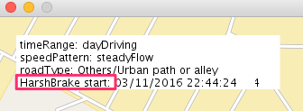
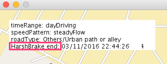
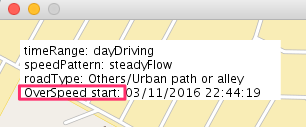
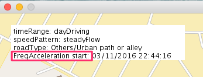

# Context Mapping and Driver Behavior Tutorial Part 2: Displaying the analysis result on a Java client map UI

This second part of the tutorial describes how you can display the driver behavior data that was created in part 1 of this tutorial as a map overlay where driving behavior such as harsh braking or frequent acceleration can be identified.

<p align="center">

</br>Figure of the MapView user interface with a sample trip and trip data overlay.
</p>

## Overview

In part 2 of this tutorial, you will learn the following:

1. How to build the *map-driver-insights* application.
2. How to configure the *MapView*.
3. How to run the *MapView* UI to explore driver behavior.

### Architecture
<p align="center">

</br>Architecture diagram of the Watson IoT Context Mapping and Driver Behavior services.
</p>

## Before you begin
## System requirements
To complete the tutorial, the following prerequisite software must be installed on your system:

- Java 1.7 or higher to run the *MapView* application.
- [Git](https://git-scm.com/) to clone project code locally.
- Requires [maven](https://maven.apache.org/download.cgi) to build the *MapView* application.

## Deliverables
When you complete part 2 of this tutorial, the following components are downloaded:  

|File|Description|
|----|-----------|
|[src/main/java/com/ibm/iot/auto/bluemix/samples/ui/](src/main/java/com/ibm/iot/auto/bluemix/samples/ui/)<br/>`*.java`|Source files for sample application. [MapView.java](com.ibm.iot.auto.bluemix.samples.ui/src/com/ibm/iot/auto/bluemix/samples/ui/MapView.java) contains the `main()` method.|
|[data/CarProbeSample.json](data/CarProbeSample.json)|Input file for sample application.|
|[config/mapview.json](config/mapview.json)|Configuration file for sample application. Edit this file to configure 'Driver Behavior' service.|


### Bluemix applications and services  
To complete the instructions in this tutorial, the following services are required in your Bluemix organization:

   * [IoT Context Mapping](https://console.ng.bluemix.net/catalog/services/context-mapping/)
   * [IoT Driver Behavior](https://console.ng.bluemix.net/catalog/services/driver-behavior/)


### Java application
The following additional components are required to complete the tutorial:

   * [Apache Commons Codec](http://commons.apache.org/proper/commons-codec/index.html)
   * [Unfolding](http://unfoldingmaps.org/)


## Tutorial Part 2: Displaying the analysis result on a Java client map UI

Before you start part 2 of the tutorial you must have completed [*Context Mapping and Driver Behavior tutorial, Part 1: Sending car probe data and issuing analysis requests*](https://github.com/IBM-Bluemix/car-data-management) and have successfully loaded driving data to your **Driver Behavior** service.

### Step 1: Build the MapView application
The following steps provide a sequential outline of how to build the MapView application and how to run it.

1. Clone the **map-driver-insights** project by using git clone, as follows:

    ```
    git clone https://github.com/IBM-Bluemix/map-driver-insights
    ```

1. Navigate to the **map-driver-insights** project.

    ```
    cd map-driver-insights
    ```

1. Download [the unfolding package](http://unfoldingmaps.org/downloads) and decompress it into `extlibs` folder.

    ```
    cd extlibs
    
    curl -L -O https://github.com/tillnagel/unfolding/releases/download/v0.9.6/unfolding_app_template_with_examples_0.9.6.zip
    
    unzip unfolding_app_template_with_examples_0.9.6.zip 
    ```
    **Note:** The actual zip file name and the unfolding jar file name depend on the package version that you downloaded.
    
1. Install the unfolding jars into Maven.

    ```
    cd lib

    mvn install:install-file -Dfile=./Unfolding.0.9.6.jar -DgroupId=org.unfoldingmaps -DartifactId=unfolding -Dversion=0.9.6 -Dpackaging=jar
    
    mvn install:install-file -Dfile=./json4processing.jar -DgroupId=org.unfoldingmaps -DartifactId=json4processing -Dversion=0.9.6 -Dpackaging=jar
    ```

1. Run the maven build as follows to build the Java client.

    ```
    cd ../..
    
    mvn clean compile
    ```
Apache Commons Codec and all required dependencies are downloaded and the build process starts.


### Step 2: Set configuration file
The following steps provide how to set values into configuration file.


1. Open the `config/mapview.json` in a text editor.

   ```
   vi config/mapview.json
   ```

2. Enter the values for `tenant_id`, `username`, and `password` that you got when you registered the **IoT Driver Behavior** service.   
  **Important:** These user credentials are different from your Bluemix credentials.
<pre>
{
  "api": "https://automotive.internetofthings.ibmcloud.com/driverinsights",
  "tenant_id": "<i><b>Tenant ID for IoT Driver Behavior</b></i>",
  "username": "<i><b>User name for IoT Driver Behavior</b></i>",
  "password": "<i><b>Password for IoT Driver Behavior</b></i>"
}
</pre>


### Step 3: Explore driver behavior in the MapView user interface
1. Run the following in a shell to display a map with the vehicle traces.  
<pre>
mvn test -Dexec.args="--job_ID <i><b>JOBID</b></i>"
</pre>
Where <i><b>`JOBID`</b></i> is the `job_id` value that was returned when you completed *"Context Mapping and Driver Behavior tutorial, Part 1: Sending car probe data and issuing analysis requests"*.  

2. Explore the MapView map overlay.  
In the MapView, the red line overlays show the vehicle trace and green line segments show where a particular driving behavior occurred.


<p align="center">

</p>

  * Type "+" key to zoom in, and type "-" key to zoom out.

  * Place the mouse over the green circle, and you can see a description of the behavior such as the followings.

<p align="center">

</p>   
<p align="center">

</p>   
<p align="center">

</p>   
<p align="center">

</p>   
   
   

## Decomposition Instructions

This sample application uses the [Unfolding maps framework](http://unfoldingmaps.org/) to display maps and draw figures on the map. It uses the **Driver Behavior** REST APIs to retrieve the driving behavior of a driver and draws vehicle traces on the map. The first part of the application reads in the input JSON file and draws the vehicle traces. The second part retrieves the driving behavior from the **Driver Behavior** service.

Here's a description of the sample application Java classes.

|Java class|Description|
|----------|-----------|
|Configuration|Reads in the configuration JSON file, `mapview.json` and made available to other class instances.|
|Connection|Low level HTTP connection is established. REST calls are initiated and HTTP response is gathered here.|
|DriverService|Higher level calls to the service is performed. Public methods map to REST APIs.|
|InputData|Input data is an array of JSON objects. The input JSON object is defined here.|
|MapView|This class reads in the configuration file and input data file. Starts the `DriverService` and calls `getAllTripUuIds()` to get the `tripUuId`s. It then calls `getAllDriverBehaviorDetails()` using the `tripUuId` to get the driving behaviors.|
|ToolTipMarker|This is a helper to draw a tool tip for showing the driving behavior.|

This is what the REST call looks like if you want to try executing it directly.
 (This REST call returns an array of driver behavior.)

```HTTP
https://automotive.internetofthings.ibmcloud.com/driverinsights/drbresult/trip?tenant_id=123&trip_uuid=456
```

## API Documentation
* [IBM Watson IoT Driver Behavior](http://ibm.biz/IoTDriverBehavior_APIdoc)
* [IBM Watson IoT Context Mapping](http://ibm.biz/IoTContextMapping_APIdoc)

## Copyright
* [&copy; OpenStreetMap contributors](http://www.openstreetmap.org/copyright)
* [Open Data Commons Open Database License (ODbL)](http://opendatacommons.org/licenses/odbl/)